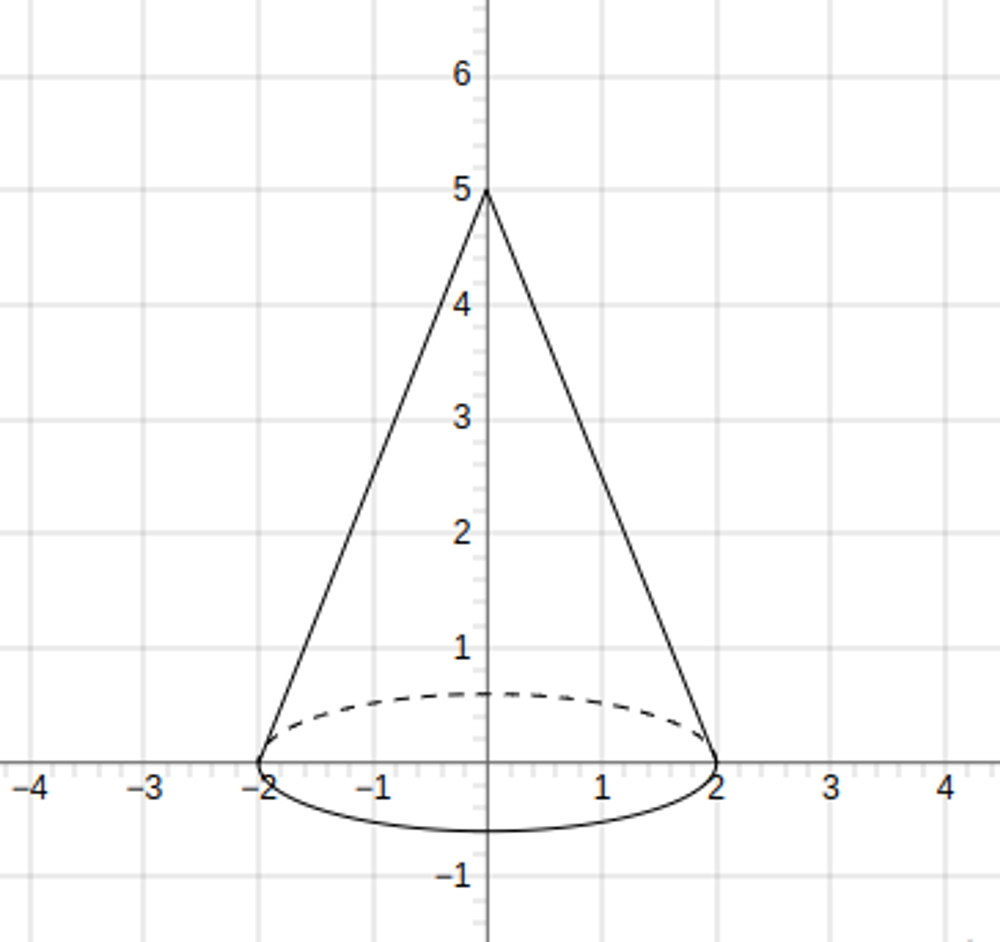
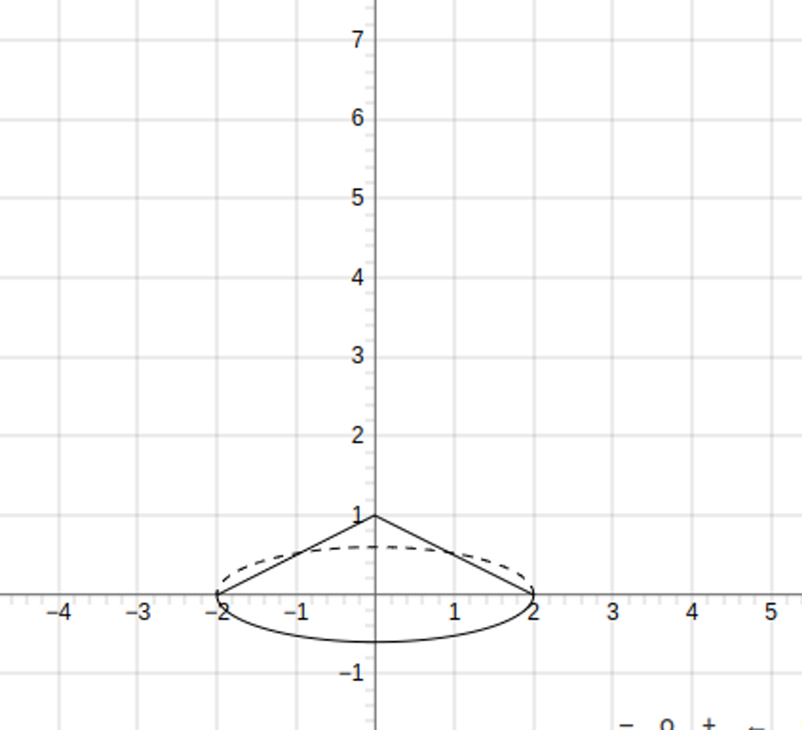
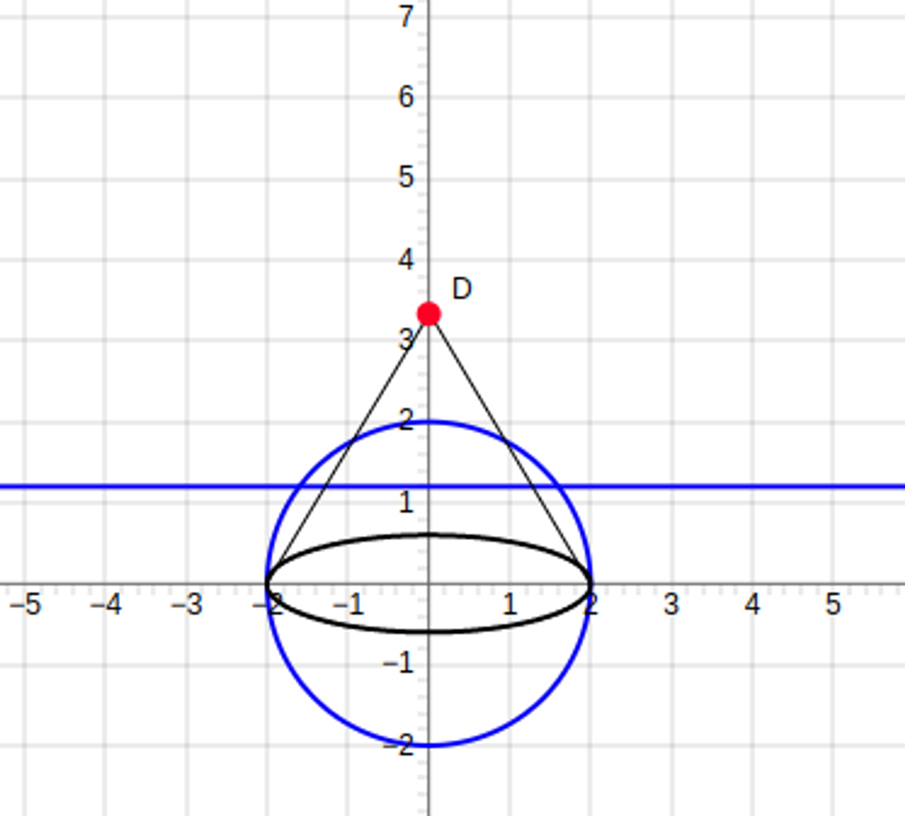
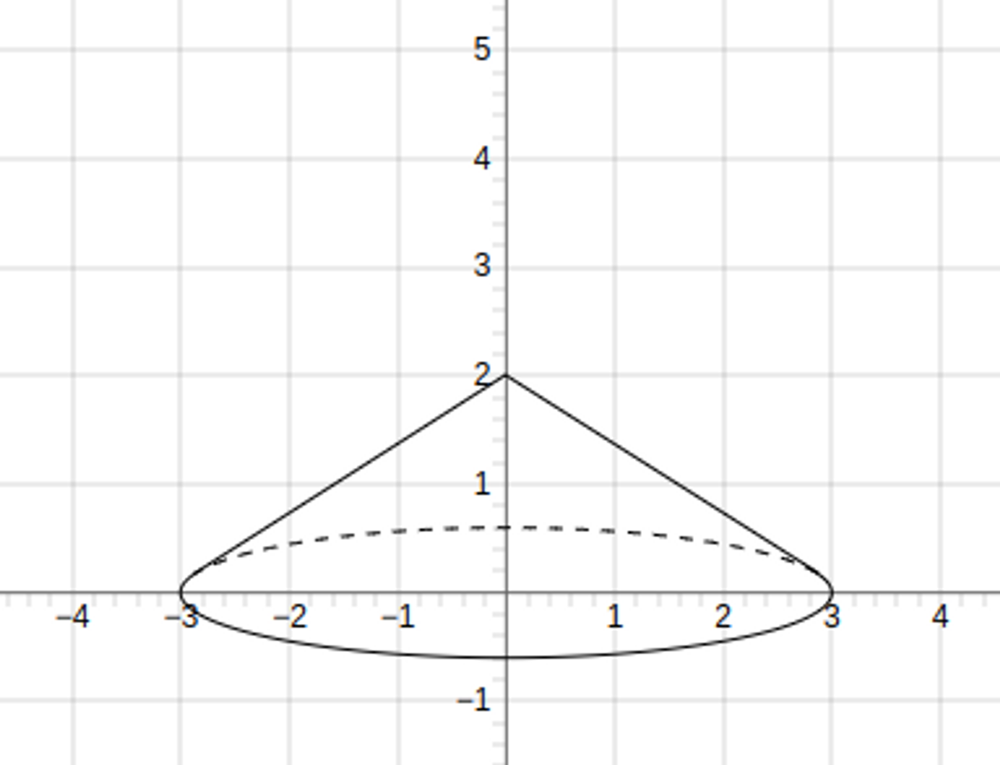

JSXGraph 라이브러리를 활용하여 다양한 수학 문제의 도형 보기를 제작할 수 있습니다.

우선 간단한 도형 만들기부터 연습하고 있습니다.

# 원기둥

### 결과물


<details>
<summary><h3>코드</h3></summary>

```javascript
let createCylinder = (brd: any, height: number, radius: number) => {
  brd.suspendUpdate();

  const scaleRatio = 0.3;   // 기존의 원을 얼마나 찌그러트릴지 -> ellipse처럼 보이도록
  const strokeWidth = 1;    // 선분의 두께
  const color = "black";    // 선분의 색상

  // 도형을 변화시키는 element, 여기서는 y축을 축소시킴
  let transformScale = brd.create('transform', [1, scaleRatio], {type: "scale"});

  // 점들을 정의하자
  // 아랫면의 가운데, 왼쪽, 오른쪽
  let bottomPointCenter = brd.create('point', [0, 0], {
    visible: false
  })
  let bottomPointLeft = brd.create('point', [-radius, 0], {
    visible: false
  })
  let bottomPointRight = brd.create('point', [radius, 0], {
    visible: false
  })
  // 윗면의 가운데, 왼쪽, 오른쪽
  let upperPointCenter = brd.create('point', [0, height/scaleRatio], {
    visible: false
  })
  let upperPointLeft = brd.create('point', [-radius, height], {
    visible: false
  })
  let upperPointRight = brd.create('point', [radius, height], {
    visible: false
  })

  // 아랫면 => 보이는 부분은 실선, 보이지 않는 부분은 점선으로 표시
  let bottomCircleSolidArc = brd.create('arc', [bottomPointCenter, bottomPointLeft, bottomPointRight], {
    visible: false,
  })
  let bottomCircleSolidArcTransformed = brd.create('curve', [bottomCircleSolidArc, transformScale], {
    strokeWidth: strokeWidth,
    strokeColor: color,
    highlightStrokeColor: color,
  })
  let bottomCircleDashArc = brd.create('arc', [bottomPointCenter, bottomPointRight, bottomPointLeft], {
    visible: false, 
  })
  let bottomCircleDashArcTransformed = brd.create('curve', [bottomCircleDashArc, transformScale], {
    strokeWidth: strokeWidth, 
    strokeColor: color,
    highlightStrokeColor: color,
    dash: 2,
  })

  // 윗면
  let upperCircle = brd.create('circle', [upperPointCenter, radius], {
    visible: false, 
  });
  let upperCircleScaled = brd.create('circle', [upperCircle, transformScale], {
    fixed: true,
    strokeWidth: strokeWidth, 
    strokeColor: color,
    hightlightStorkeWidth: strokeWidth,
    highlightStrokeColor: color,
  })

  // 원기둥 양 옆 선
  let leftLine = brd.create('segment', [bottomPointLeft, upperPointLeft], {
    fixed: true,
    strokeWidth: strokeWidth, 
    strokeColor: color,
    hightlightStorkeWidth: strokeWidth,
    highlightStrokeColor: color,
  })
  let rightLine = brd.create('segment', [bottomPointRight, upperPointRight], {
    fixed: true,
    strokeWidth: strokeWidth, 
    strokeColor: color,
    hightlightStorkeWidth: strokeWidth,
    highlightStrokeColor: color,
  })

  brd.unsuspendUpdate();
}
```

</details>

### 원기둥에 사용된 element

1. **transformation**
   
   - 만들어진 element에 변화를 주는 요소입니다.
   - transfer, scale, rotate 등 다양한 type이 존재하며, 원기둥에서는 `type: "scale"`을 이용했습니다.
   - x값은 1, y값은 0.3만큼 기존 element의 값을 scale합니다.
     - 따라서 ellipse를 지정하지 않고, circle를 이용해 간단하게 타원을 생성할 수 있습니다.
   - `let transformScale = brd.create('transform', [1, scaleRatio], {type: "scale"})`

2. **circle**
   
   - 원기둥의 윗면을 생성합니다.
   - circle과 transform을 함께 이용하여, 쉽게 타원을 생성할 수 있습니다.

3. **arc**
   
   - 호에 해당하는 element입니다.
   - 원기둥의 아랫면에서 눈에 보이는 부분은 실선, 눈에 보이지 않는 부분은 점선으로 표현하기 위해 사용했습니다.
   - arc도 마찬가지로 transformation을 이용해 타원처럼 보이도록 했습니다.

4. **segment**
   
   - 두 점을 이용해 선분을 만듭니다.

# 원뿔 만들기

## 1차 시도

> 단순히 원기둥처럼 접근해보자

- 아주 그럴싸해 보이지만….
  
  

- 원뿔의 높이가 낮을 때 문제가 생긴다.
  
  

- 이를 해결하기 위해 단순히 보이는 부분, 안보이는 부분으로 나누면 안되고, 아랫면과 꼭지점의 접선을 구해야 한다!

## 2차 시도

> 밑면의 접선을 이용하면 어떨까

1. 밑면의 polarLine을 구한다.

2. 밑면과 polarLine의 교점을 2개 구한다

3. 교점과 높이가 되는 꼭지점을 잇는다.

4. 교점을 기준으로 실선과 점선을 표시한다.
- 문제점
  
  
  
  - 타원형이 된 밑면이 아닌, 기존의 원의 polar line을 구하게 된다.

## 3차 시도

> polar line, intersection 전부 다 transform 하기

### 결과물



- input : `height`, `radius`

<details>
<summary><h3>코드</h3></summary>

```javascript
const createCone = (brd: any, height: number, radius: number) => {

  const scaleRatio = 0.2;   // 기존의 원을 얼마나 찌그러트릴지 -> ellipse처럼 보이도록
  const strokeWidth = 1;    // 선분의 두께
  const color = "black";    // 선분의 색상

  // 도형을 변화시키는 element, 여기서는 y축을 축소시킴
  let transformScale = brd.create('transform', [1, scaleRatio], {type: "scale"});

  // 점들을 정의하자
  // 아랫면의 가운데, 왼쪽, 오른쪽
  let bottomPointCenter = brd.create('point', [0, 0], {
    visible: false
  })
  let bottomPointLeft = brd.create('point', [-radius, 0], {
    visible: false
  })
  let bottomPointRight = brd.create('point', [radius, 0], {
    visible: false
  })
  // 원뿔의 꼭지점
  let vertexPointCenter = brd.create('point', [0, height], {
    visible: false
  })
  let vertexPointCenterScaled = brd.create('point', [0, height/scaleRatio], {
    visible: false
  })

  // 1. 아랫면 그리기
  let bottomCircle = brd.create('circle', [bottomPointCenter, radius], {
    visible: false
  });

  // 2. 생성된 아랫면의 polarLine 구하기
  let polarLine = brd.create('polarline', [vertexPointCenterScaled, bottomCircle], {
    visible: false
  })

  // 3. 접점의 위치 구하기
  let leftIntersectionPoint = brd.create('intersection', [bottomCircle, polarLine, 0], {
    visible: false
  })
  let rightIntersectionPoint = brd.create('intersection', [bottomCircle, polarLine, 1], {
    visible: false
  })

  // 4. 접점 위치 낮추기
  let leftIntersectionPointScaled = brd.create('glider', [rightIntersectionPoint, transformScale, bottomCircle], {
    visible: false
  })
  let rightIntersectionPointScaled = brd.create('glider', [leftIntersectionPoint, transformScale, bottomCircle], {
    visible: false
  })

  // 아랫면 => 보이는 부분은 실선, 보이지 않는 부분은 점선으로 표시
  let bottomCircleSolidArc = brd.create('arc', [bottomPointCenter, leftIntersectionPoint, rightIntersectionPoint], {
    visible: false,
  })
  let bottomCircleSolidArcTransformed = brd.create('curve', [bottomCircleSolidArc, transformScale], {
    strokeWidth: strokeWidth,
    strokeColor: color,
    highlightStrokeColor: color,
  })
  let bottomCircleDashArc = brd.create('arc', [bottomPointCenter, rightIntersectionPoint, leftIntersectionPoint], {
    visible: false, 
  })
  let bottomCircleDashArcTransformed = brd.create('curve', [bottomCircleDashArc, transformScale], {
    strokeWidth: strokeWidth, 
    strokeColor: color,
    highlightStrokeColor: color,
    dash: 2,
  })

  // 모선
  let leftGeneratrix = brd.create('segment', [vertexPointCenter, leftIntersectionPointScaled], {
    fixed: true,
    strokeWidth: strokeWidth, 
    strokeColor: color,
    hightlightStorkeWidth: strokeWidth,
    highlightStrokeColor: color,
  })
  let rightGeneratrix = brd.create('segment', [vertexPointCenter, rightIntersectionPointScaled], {
    fixed: true,
    strokeWidth: strokeWidth, 
    strokeColor: color,
    hightlightStorkeWidth: strokeWidth,
    highlightStrokeColor: color,
  })
}
```

</details>

### 사용한 element

1. **transformation**
   
   - 만들어진 element에 변화를 주는 요소입니다.
   - transfer, scale, rotate 등 다양한 type이 존재하며, 원뿔에서는 `type: "scale"`을 이용했습니다.
   - x값은 1, y값은 0.2만큼 기존 element의 값을 scale합니다.
     - 따라서 ellipse를 생성하지 않고, circle를 이용해 간단하게 타원을 생성할 수 있습니다.
   - `let transformScale = brd.create('transform', [1, scaleRatio], {type: "scale"})`

2. **polar line**
   
   - 원뿔 또는 원에 대한 점의 극선에 대한 생성자를 제공하는 데 사용됩니다.
   - 원(혹은 원뿔)에서, 외부의 한 점에서 접선을 그을 때 생기는 접점 두 개를 잇는 선입니다.
   - 이 선을 이용해 꼭짓점과 밑면의 접점을 구할 수 있습니다.

3. **intersection**
   
   - 교점을 찾아내는 element입니다.
   - polar line과 밑면의 교점을 찾기 위해 사용했습니다.
   - 배열의 세 번째 값으로 0을 넣으면 positive square root, 1을 넣으면 negative square root 값을 구할 수 있습니다.

4. **segment**
   
   - 두 점을 이용해 선분을 만듭니다.
   - intersection과 꼭짓점을 이어 원뿔의 모선을 생성했습니다.

# 향후 계획

- options 습득하기
- 높이/길이 표기, 각 표기하기
- 서버에서 넘어오는 DTO 확인 후 코드 리팩토링 진행
