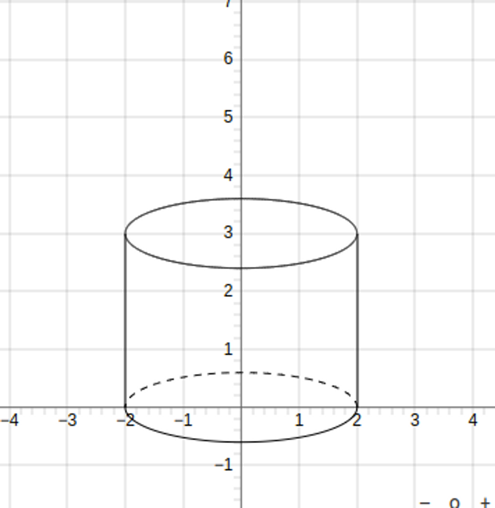

JSXGraph 라이브러리를 활용하여 다양한 수학 문제의 도형 보기를 제작할 수 있습니다.

우선 간단한 도형 만들기부터 연습하고 있습니다.

# 원기둥

### 결과물



<details>
<summary><h3>코드</h3></summary>

```javascript
let createCylinder = (brd: any, height: number, radius: number) => {
  brd.suspendUpdate();

  const scaleRatio = 0.3;   // 기존의 원을 얼마나 찌그러트릴지 -> ellipse처럼 보이도록
  const strokeWidth = 1;    // 선분의 두께
  const color = "black";    // 선분의 색상

  // 도형을 변화시키는 element, 여기서는 y축을 축소시킴
  let transformScale = brd.create('transform', [1, scaleRatio], {type: "scale"});

  // 점들을 정의하자
  // 아랫면의 가운데, 왼쪽, 오른쪽
  let bottomPointCenter = brd.create('point', [0, 0], {
    visible: false
  })
  let bottomPointLeft = brd.create('point', [-radius, 0], {
    visible: false
  })
  let bottomPointRight = brd.create('point', [radius, 0], {
    visible: false
  })
  // 윗면의 가운데, 왼쪽, 오른쪽
  let upperPointCenter = brd.create('point', [0, height/scaleRatio], {
    visible: false
  })
  let upperPointLeft = brd.create('point', [-radius, height], {
    visible: false
  })
  let upperPointRight = brd.create('point', [radius, height], {
    visible: false
  })

  // 아랫면 => 보이는 부분은 실선, 보이지 않는 부분은 점선으로 표시
  let bottomCircleSolidArc = brd.create('arc', [bottomPointCenter, bottomPointLeft, bottomPointRight], {
    visible: false,
  })
  let bottomCircleSolidArcTransformed = brd.create('curve', [bottomCircleSolidArc, transformScale], {
    strokeWidth: strokeWidth,
    strokeColor: color,
    highlightStrokeColor: color,
  })
  let bottomCircleDashArc = brd.create('arc', [bottomPointCenter, bottomPointRight, bottomPointLeft], {
    visible: false, 
  })
  let bottomCircleDashArcTransformed = brd.create('curve', [bottomCircleDashArc, transformScale], {
    strokeWidth: strokeWidth, 
    strokeColor: color,
    highlightStrokeColor: color,
    dash: 2,
  })

  // 윗면
  let upperCircle = brd.create('circle', [upperPointCenter, radius], {
    visible: false, 
  });
  let upperCircleScaled = brd.create('circle', [upperCircle, transformScale], {
    fixed: true,
    strokeWidth: strokeWidth, 
    strokeColor: color,
    hightlightStorkeWidth: strokeWidth,
    highlightStrokeColor: color,
  })

  // 원기둥 양 옆 선
  let leftLine = brd.create('segment', [bottomPointLeft, upperPointLeft], {
    fixed: true,
    strokeWidth: strokeWidth, 
    strokeColor: color,
    hightlightStorkeWidth: strokeWidth,
    highlightStrokeColor: color,
  })
  let rightLine = brd.create('segment', [bottomPointRight, upperPointRight], {
    fixed: true,
    strokeWidth: strokeWidth, 
    strokeColor: color,
    hightlightStorkeWidth: strokeWidth,
    highlightStrokeColor: color,
  })

  brd.unsuspendUpdate();
}
```

</details>

### 원기둥에 사용된 element

1. **transformation**
   
   - 만들어진 element에 변화를 주는 요소입니다.
   - transfer, scale, rotate 등 다양한 type이 존재하며, 원기둥에서는 `type: "scale"`을 이용했습니다.
   - x값은 1, y값은 0.3만큼 기존 element의 값을 scale합니다.
     - 따라서 ellipse를 지정하지 않고, circle를 이용해 간단하게 타원을 생성할 수 있습니다.
   - `let transformScale = brd.create('transform', [1, scaleRatio], {type: "scale"})`

2. **circle**
   
   - 원기둥의 윗면을 생성합니다.
   - circle과 transform을 함께 이용하여, 쉽게 타원을 생성할 수 있습니다.

3. **arc**
   
   - 호에 해당하는 element입니다.
   - 원기둥의 아랫면에서 눈에 보이는 부분은 실선, 눈에 보이지 않는 부분은 점선으로 표현하기 위해 사용했습니다.
   - arc도 마찬가지로 transformation을 이용해 타원처럼 보이도록 했습니다.

4. **segment**
   
   - 두 점을 이용해 선분을 만듭니다.
